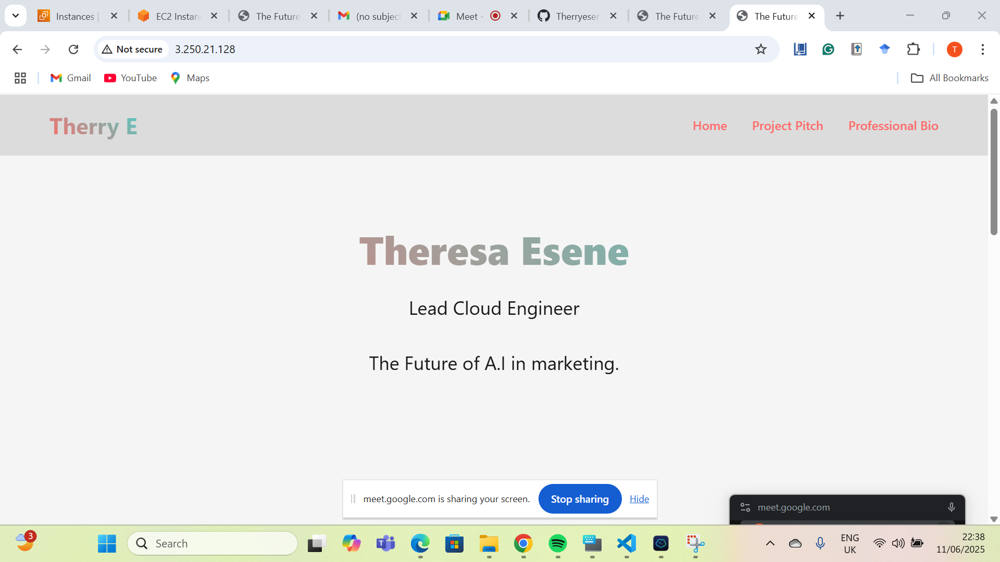

# Altschool second semester exam.
## Project Description
- Create a Dynamic Landing Page for your startup team in order to showcase your technical skills to investors.
## Technologies used
- VScode
- termius
- AWS
- GitHub
- Nginx
- html
- CSS
- Certbot
## 1. Server Provisioning
- For my server provisoning, I made use of the AWS server. I created an EC2 Instance, selecting Ireland as my location -With my Keypair being "irl-key-1.pem". 

- In setting up my instance, I allowed HTTP be 80, HTTPS- 443, and SSH Port- 22.
Using the Termius terminal, I was able to connect to be AWS live server. 

## 2. Web Server Set up.
- While setting up the server, the Ubuntu server 22.4 (Free tier) was selected.

- The public IP addressed that was provided was 3.250.21.128. 

- Once the live server was connect through Terminus, certain plugins such as Nginx, Python3, and Certbot were installed.

- Using the command "Sudo apt install ...", I was successfully able to install those plugins

## 3. Dynamic Landing Page
- Vscode was employed to create the dynamic landing page.

- The webpage is divided into 3 sections: The introduction page -which has the start up logo, student name and title. The Pitch page which goes in depth on the purpose of the project and what the team is set to achieve through the project. Finally, there is the professional Bio page, which talks about my professional experience and skills.

- CSS was used to style the webpage making use of responsive design, grid layout, linear gradients, modern typography and clean styling

- The colour patterns selected for the webpage were to give in a "Tech-forward" and clean look, while adding a little personality.

- The structure of the page consisted of several sections -the header, container, pitch section, bio section, and the footer.

- Responsive design was set at 768px and below, to enable readability and a structure appearance on smaller screens. The is achieved by using the "@media" prompt.

- Once completed, the landing page was pushed into GitHub using this repository -https://github.com/Therryesene/Alt-exam.git

- Last minute changes were made to my webpage in order to give it a more professional and readable look.

- These changes were re-commited into GitHub.

## 4. Setting up the sub domain

- My subdomain was gotten via the FreeDNS website.

- The domain created is - https://teehub.jumpingcrab.com/

- The site was cloned into a Ngnix root using the termius terminal but using the "sudo git clone..." command.

## 5. Securing Webpage

- Once cloned, Nginx and certbot were installed on termius in order to enable the site and secure the site -switch from HTTP to HTTPS.

- Ngnix was installed using the command "sudo apt install ngnix -y".

- A ngnix default root was created -/var/www/html, which the cloned repository was saved into. 

- To obtain and install SSL, the command "sudo certbot --nginx -d teehub.jumpingcrab.com -d www.teehub.jumpingcrap.com". Then I allowed Certbot to redirect HTTP TO HTTPS.

